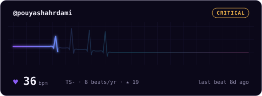
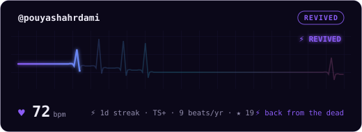
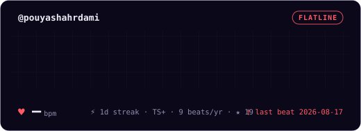
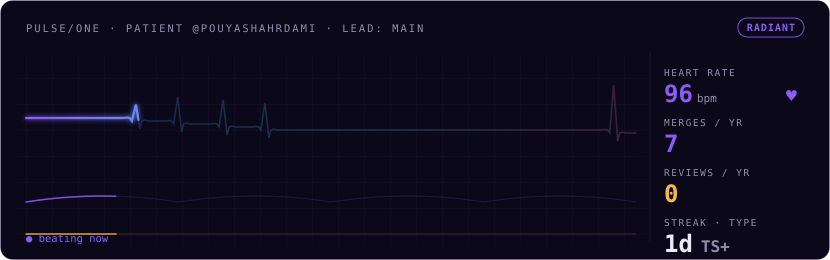
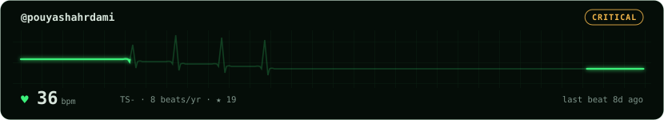
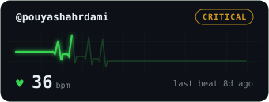
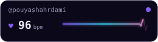
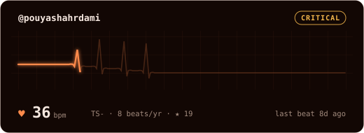
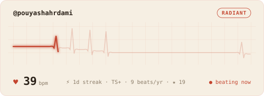

# github-pulse 🫀

[](https://github.com/pouyashahrdami/github-pulse/actions/workflows/ci.yml)

**A living EKG card for your GitHub README.** One username in, a beating heart out —
it beats faster when you ship, dims when you rest, flatlines when you vanish, and
revives when you come back.

<p align="center">
  
</p>

<p align="center">
  <a href="https://vercel.com/new/clone?repository-url=https%3A%2F%2Fgithub.com%2Fpouyashahrdami%2Fgithub-pulse&env=GITHUB_TOKEN&envDescription=Classic%20GitHub%20token%2C%20no%20scopes%20needed&project-name=github-pulse&repository-name=github-pulse">
    
  </a>
</p>

Unlike every static stats card, your pulse card is generated *at the moment someone
views it*. Time actually passes on it.

```md
[](https://YOUR-DEPLOYMENT.vercel.app)
```

## What the card shows

- **A real EKG waveform** — one beat per day for your last 14 days; beat height =
  contributions that day. Zero-commit days stay flat. The waveform's P/T-waves and
  jitter are seeded from your username, so no two hearts look alike.
- **BPM** — derived from your weekly contribution count.
- **Life state** — `RADIANT → STEADY → FADING → CRITICAL → FLATLINE`, computed from
  time since your last contribution. Come back after a 14-day flatline and the card
  stamps `⚡ REVIVED` for 48 hours.
- **Blood type** — your top language, typed (`TS+`, `PY-`, `RS+`…). The sign is
  live: `+` if you shipped this week.
- **Streak, yearly beats, stars** — and a `● beating now` indicator when your last
  beat was today.

## The life cycle

The card decays in real time and earns its way back:

```
RADIANT → STEADY → FADING → CRITICAL → FLATLINE → ⚡ REVIVED
 <24h      ≤3d      ≤7d       <14d       ≥14d      first beat after
```

Go quiet for two weeks and your card literally dies in public — time of death
printed on it. Your first commit after a flatline stamps `⚡ REVIVED` on the card.


<br>


Preview any state without waiting to die: `?state=radiant|steady|fading|critical|flatline|revived`.

## Shapes

Add `?size=<name>` to fit your README layout:

| size | dimensions | good for |
|---|---|---|
| `card` *(default)* | 520×190 | next to other stat cards |
| `monitor` | 830×260 | the full vitals monitor — three traces + numbers column |
| `wide` | 830×150 | full-width banner across the README |
| `compact` | 340×130 | sidebars, small profiles |
| `badge` | 260×70 | one-liners, project READMEs, bios |




<br>



## Themes

Add `?theme=<name>`:

| theme | vibe |
|---|---|
| `aura` *(default)* | violet→cyan→magenta gradient glow |
| `phosphor` | classic green hospital monitor |
| `cyber` | ice-cyan |
| `ember` | burning amber |
| `rose` | hot magenta |
| `github` | matches the contribution graph |
| `mono` | white on black |
| `paper` | printed ECG strip (light) |
| `dracula` | matches the Dracula editor theme |
| `tokyonight` | matches Tokyo Night |
| `catppuccin` | matches Catppuccin Mocha |
| `nord` | matches Nord |
| `gruvbox` | matches Gruvbox |


<br>

<br>


**[→ See all 13 themes in the gallery](./docs/THEMES.md)**

*(Samples above are snapshots committed to this repo — your embed is generated live.)*

## Custom colors

Every color is overridable with hex query params (no `#`):

```
/u/username?color=ff2d95&bg=141021&text=ffffff&accent=ff2d95&muted=8888aa
```

| param | controls |
|---|---|
| `color` | the EKG trace |
| `bg` | card background (`bg=transparent` works too) |
| `text` | primary text |
| `accent` | state pill highlights |
| `muted` | secondary text |
| `border` | card border (`border=0` hides it) |

And shape/behavior params:

| param | values | default |
|---|---|---|
| `size` | `card` `wide` `compact` | `card` |
| `radius` | corner rounding `0`–`24` | `12` |
| `grid` | `0` hides the ECG grid | `1` |
| `glow` | `0` disables the glow filter | `1` |
| `days` | beat window `7`–`30` | `14` |
| `label` | custom header text (max 32 chars) | `@username` |
| `hide` | comma list: `pill` `bpm` `stats` `status` | — |
| `anim` | `0` renders a fully static card | `1` |
| `speed` | animation speed `0.25`–`3` | `1` |
| `state` | preview a life state (see above) | live |
| `wave` | `ecg` heartbeat or `smooth` aura wave | `ecg` |
| `tz` | UTC offset in hours (e.g. `3.5`) so late-night commits count to your local day | `0` |

Params compose with a theme: start from `?theme=phosphor` and override just `bg`.

## Light & dark mode

GitHub READMEs support the `<picture>` element, so your pulse can match the
viewer's theme — one card for dark mode, another for light:

```html
<picture>
  <source media="(prefers-color-scheme: dark)"
          srcset="https://YOUR-DEPLOYMENT.vercel.app/u/YOU?theme=aura">
  
</picture>
```

The site's builder has an **adaptive** toggle that generates this snippet for you.

## Zero-server mode (GitHub Action)

Don't want to depend on anyone's server — including ours? Let your own repo's
Actions regenerate the card on a schedule. No token setup at all: the workflow's
built-in `GITHUB_TOKEN` is used automatically.

Add `.github/workflows/pulse.yml` to your profile repo (the one named after you):

```yaml
name: pulse
on:
  schedule:
    - cron: "23 */6 * * *" # every 6 hours
  workflow_dispatch:
permissions:
  contents: write
jobs:
  pulse:
    runs-on: ubuntu-latest
    steps:
      - uses: actions/checkout@v4
      - uses: pouyashahrdami/github-pulse@main
        with:
          username: YOUR_USERNAME
          theme: aura            # optional
          size: card             # optional
          params: "tz=3.5"       # optional: any URL param
      - name: Commit the card
        run: |
          git config user.name "github-actions[bot]"
          git config user.email "41898282+github-actions[bot]@users.noreply.github.com"
          git add pulse.svg
          git diff --cached --quiet || git commit -m "pulse: update"
          git push
```

Then embed it with a relative path:

```md

```

**Honest trade-off:** this mode is a snapshot refreshed on your cron, so decay and
`● beating now` are only as fresh as the last run. The bot commits are authored by
`github-actions[bot]`, so they don't touch your own contribution graph. For
real-time decay, use the URL endpoint instead.

## Deploy your own (free)

1. Fork this repo.
2. [Import it into Vercel](https://vercel.com/new) — zero config, the defaults work.
3. *(Recommended)* Add a `GITHUB_TOKEN` env var — a classic token with **no scopes**
   ([create one](https://github.com/settings/tokens)). With it you get the full
   365-day contribution calendar via GraphQL at 5,000 req/h. Without it, the card
   falls back to recent public events at 60 req/h.
4. Your card lives at `https://<your-app>.vercel.app/u/<username>`.

## Local dev

```bash
pnpm install
pnpm dev
```

Open `http://localhost:3000`, or hit `http://localhost:3000/u/<username>` directly.

## How it stays alive

GitHub proxies README images through camo and strips scripts, so all animation is
pure CSS inside the SVG — the sweep, the thumping heart, the blinking dot. The
endpoint sends short cache headers (`s-maxage=900`) because decay is the product:
camo re-fetches every ~30–60 minutes, and the card it gets reflects how long you've
been quiet.

Private contributions count only if you've enabled *Include private contributions*
on your GitHub profile — same rule as every other stats card.

## License

MIT
