# Theme gallery

All 13 built-in themes, live-rendered. Use any with `?theme=<name>`, and remember
every color is individually overridable — see the [params reference](../README.md#custom-colors).

| | |
|---|---|
| **aura** *(default)* 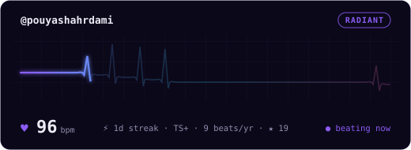 | **phosphor** 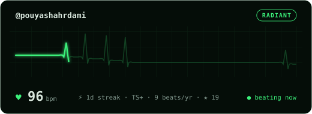 |
| **cyber** 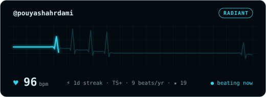 | **ember** 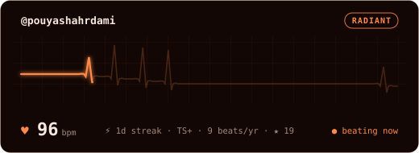 |
| **rose** 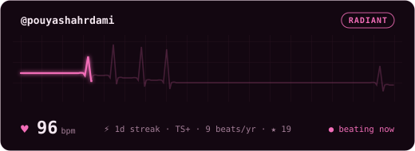 | **github** 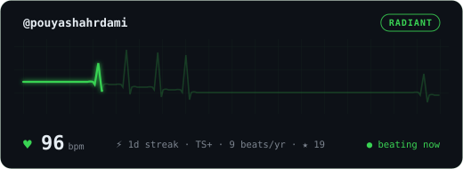 |
| **mono** 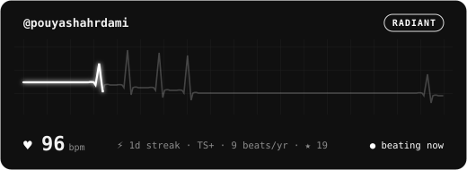 | **paper** 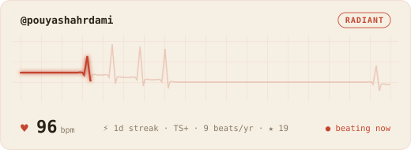 |
| **dracula** 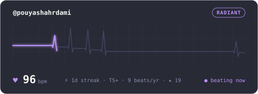 | **tokyonight** 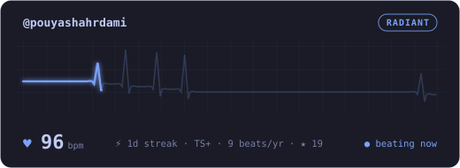 |
| **catppuccin** 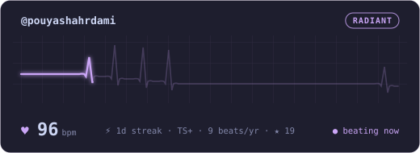 | **nord** 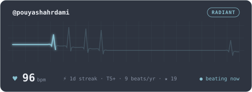 |
| **gruvbox** 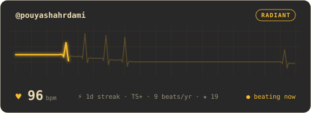 | |
